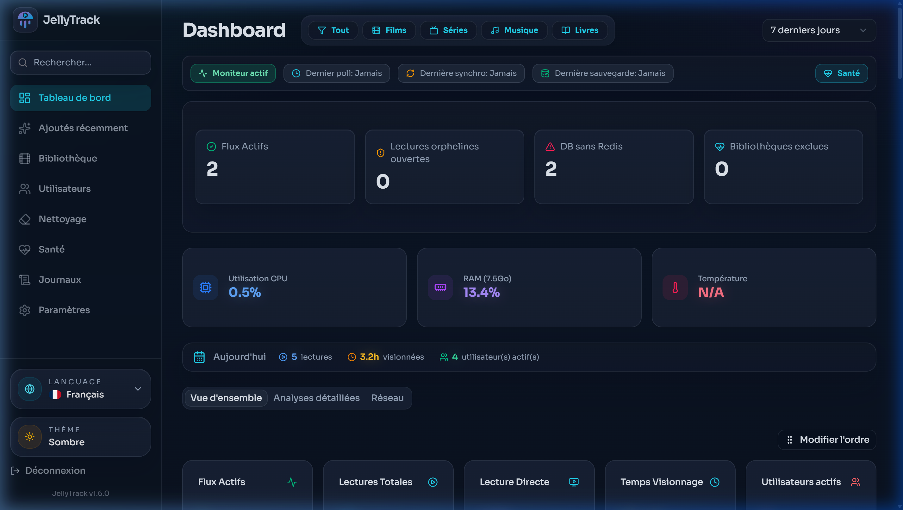
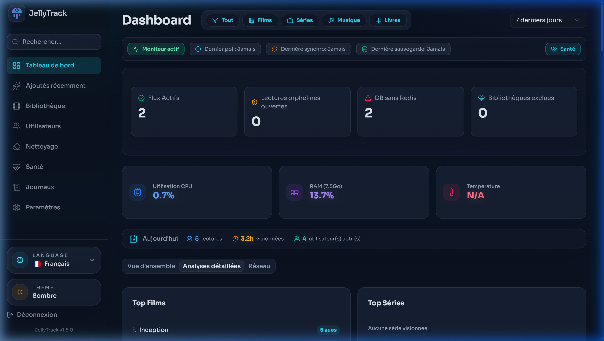
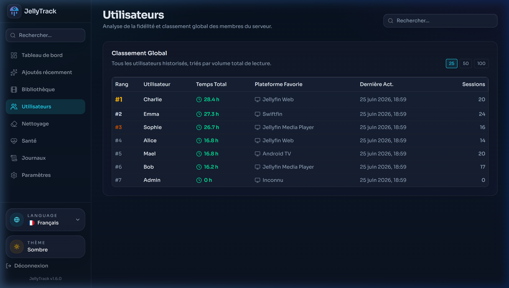
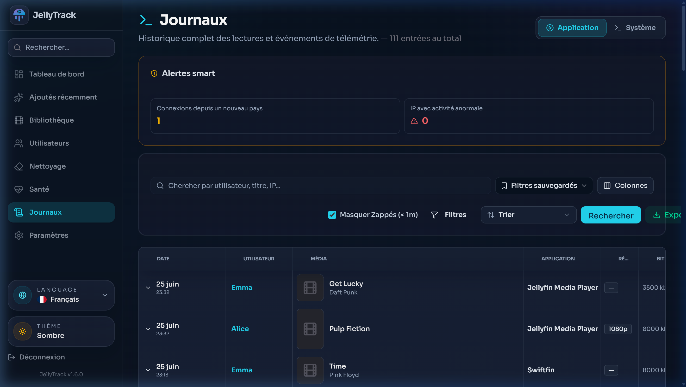
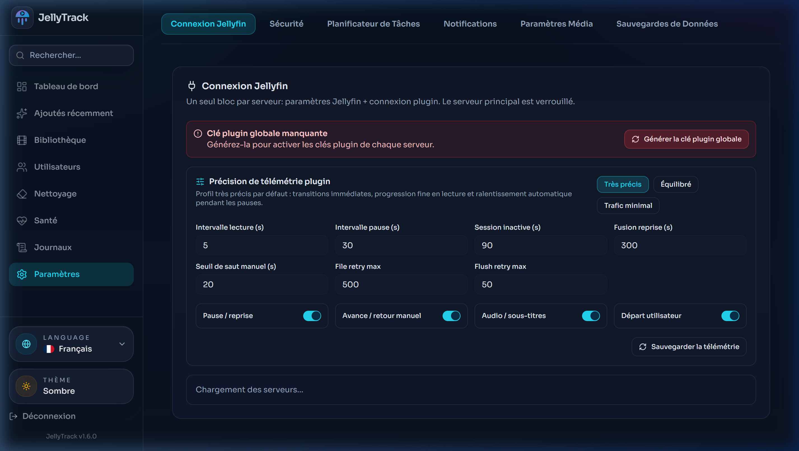

<p align="center">
  
</p>

<h1 align="center">JellyTrack</h1>

<p align="center">
  <a href="https://github.com/maelmoreau21/JellyTrack/actions/workflows/docker-publish.yml"></a>
  <a href="https://ghcr.io/maelmoreau21/JellyTrack"></a>
</p>

<p align="center">
  <strong>Observability and analytics for Jellyfin: live sessions, enriched history, downloads, and fine playback telemetry.</strong>
</p>

## Preview

### 📊 Main Dashboard


### 📈 Detailed Analytics


### 👥 Users & Activity


### 📜 Playback History & Telemetry


### ⚙️ Settings


---

> [!CAUTION]
> JellyTrack requires the companion Jellyfin plugin. Without it, JellyTrack cannot collect playback, download, seek, language, or telemetry events.
>
> Plugin repository: [Jellyfin.Plugin.JellyTrack](https://github.com/maelmoreau21/Jellyfin.Plugin.JellyTrack)

## What JellyTrack Tracks

- Live sessions: user, device, client, direct play/transcode, bitrate, IP and GeoIP.
- Playback history: completed, partial, and abandoned media using cumulative user + media history.
- Downloads: a downloaded media item is counted as one complete view and full watched duration.
- Fine telemetry: pause/resume, seek ranges, replay ranges, playback speed changes, audio language changes, and subtitle language changes.
- Behavior insights: skipped passages are shown as `from -> to` ranges, and language periods are derived from initial language plus later changes.

## Docker Installation

The canonical install mode is Docker Compose.

1. Copy the example environment:

```bash
cp .env.example .env
```

2. Edit `.env` and replace every `CHANGE_ME_*` value.

3. Start or update JellyTrack:

```bash
docker compose pull
docker compose up -d
```

To test local code before publishing an image:

```bash
docker build -t ghcr.io/maelmoreau21/jellytrack:latest .
docker compose up -d
```

JellyTrack runs on `http://localhost:3000` by default.

## Runtime Notes

- Docker uses Node 24.
- Prisma 7 stores its CLI datasource URL in `prisma.config.ts`.
- Runtime database access uses `@prisma/adapter-pg` with `DATABASE_URL`.
- `pnpm exec prisma generate` must be run after schema changes.
- Migrations live in `prisma/migrations`.

## Jellyfin Plugin Configuration

1. In Jellyfin, open Dashboard > Plugins > Repositories.
2. Add this repository URL:

```text
https://raw.githubusercontent.com/maelmoreau21/Jellyfin.Plugin.JellyTrack/main/manifest.json
```

3. Install the JellyTrack plugin.
4. In JellyTrack, open Settings > Jellyfin Connection, generate a plugin key, then copy the plugin endpoint and key into Jellyfin.

For Jellyfin 10.12 / 12 beta and later, configure `JELLYFIN_API_KEY` in `.env`; JellyTrack uses the `Authorization: MediaBrowser Token="..."` header.

## Plugin Event Contract

The plugin posts JSON to:

```text
POST /api/plugin/events
```

The canonical download event is:

```json
{
  "event": "MediaDownloaded",
  "eventId": "stable-plugin-event-id",
  "observedAt": "2026-05-28T18:00:00.000Z",
  "user": { "id": "jellyfin-user-id", "username": "Mael" },
  "media": {
    "id": "jellyfin-item-id",
    "title": "Movie title",
    "type": "Movie",
    "durationMs": 7200000,
    "libraryName": "Films"
  }
}
```

Accepted download aliases are `ItemDownloaded` and `DownloadCompleted`. JellyTrack stores downloads with `PlaybackHistory.eventSource = "download"`, `playMethod = "Download"`, full `durationWatched`, and a `TelemetryEvent` of type `download`. `sourceEventId` deduplicates plugin retries per server.

## Completion And Abandon Rules

JellyTrack classifies completion cumulatively by user + media. If someone starts a movie today and finishes it tomorrow, or several days later, the media becomes completed and should not remain abandoned. Period filters still limit views and duration for the selected period, but abandonment considers later resume history.

Downloads always count as complete views, including audio and short media, unless the media belongs to an excluded library.

## Authentication & SSO (v2.0.0+)

JellyTrack v2.0.0 introduces OpenID Connect (OIDC) Single Sign-On (SSO), enabling multi-factor authentication (2FA/MFA) and centralized directory management through providers like **Authentik**, **Keycloak**, **Authelia**, etc.

### SSO Configuration

Configure the following environment variables in `.env`:

```bash
# Enable SSO OIDC
OIDC_ENABLED=true
OIDC_URL=https://authentik.example.com/application/o/jellytrack/
OIDC_CLIENT_ID=jellytrack
OIDC_CLIENT_SECRET=your_oidc_client_secret

# Group mapping (LDAP/SSO directory)
OIDC_USER_GROUP=jellyfin-users
OIDC_ADMIN_GROUP=jellyfin-admins

# Emergency Local Administrator Access (optional)
JELLYTRACK_LOCAL_ADMIN_USER=admin
JELLYTRACK_LOCAL_ADMIN_PASSWORD=your_emergency_password
```

1. In your SSO provider (e.g. Authentik), create an OAuth2/OpenID Provider with Redirect URI:
   `https://<your-jellytrack-domain>/api/auth/callback/oidc`
2. Users logging in via SSO are linked automatically with their Jellyfin account based on their matching username from LDAP.
3. If `OIDC_ENABLED=false`, JellyTrack falls back to direct Jellyfin credentials authentication.

## Development

```bash
pnpm install
pnpm exec prisma generate
pnpm test
pnpm check:i18n
pnpm lint
pnpm build
pnpm outdated --json
```

`pnpm outdated --json` is expected to return `{}` after dependency updates.

## License

This project is licensed under the MIT License - see the [LICENSE](LICENSE) file for details.
