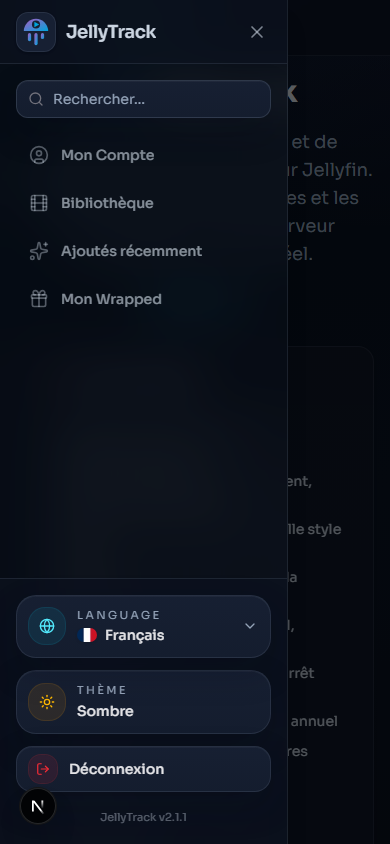
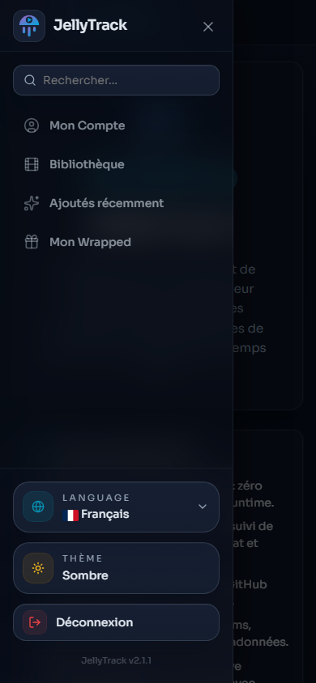

# Captures comparatives de navigation

Captures réelles, mêmes résolutions : **1440 × 900** sur desktop et **390 × 844** sur mobile. La référence est `main` au commit `a59a28613e63e86106c61827167d355b47147f42`. Les conditions et limites sont dans le [rapport](../NAVIGATION_RESTORATION.md#validation-et-captures).

Le contenu de la page À propos garde la présentation de chaque version. Le badge N appartient au serveur Next de développement. Pour comparer le menu administrateur avec Mon Compte, les captures Go utilisent une identité Jellyfin simulée ; le compte local Go n'a pas de profil Jellyfin.

| Situation | Historique `main` | Go restauré |
|---|---|---|
| Admin desktop ouvert | [Main](main-admin-desktop-open.png) | [Go](go-admin-jellyfin-single-desktop-open.png) |
| Admin desktop réduit | [Main](main-admin-desktop-collapsed.png) | [Go](go-admin-jellyfin-single-desktop-collapsed.png) |
| Admin mobile fermé | [Main](main-admin-mobile-closed.png) | [Go](go-admin-jellyfin-single-mobile-closed.png) |
| Admin mobile ouvert | [Main](main-admin-mobile-open.png) | [Go](go-admin-jellyfin-single-mobile-open.png) |
| Utilisateur desktop ouvert | [Main](main-user-desktop-open.png) | [Go](go-user-wrapped-desktop-open.png) |
| Utilisateur desktop réduit | [Main](main-user-desktop-collapsed.png) | [Go](go-user-wrapped-desktop-collapsed.png) |
| Utilisateur mobile fermé | [Main](main-user-mobile-closed.png) | [Go](go-user-wrapped-mobile-closed.png) |
| Utilisateur mobile ouvert | [Main](main-user-mobile-open.png) | [Go](go-user-wrapped-mobile-open.png) |

## Utilisateur mobile : historique puis Go

## États complémentaires Go

- [Administrateur multi-serveurs](go-admin-multi-desktop-open.png).
- [Utilisateur connecté au serveur de secours](go-user-backup-mobile-open.png).
- [Recherche globale](go-user-wrapped-desktop-search.png).
- [Santé avec Nettoyage imbriqué](go-admin-health.png).
- [Planificateur avec sections empilées](go-admin-scheduler.png).

Les deux dernières pages n'ont pas de capture historique valide : la comparaison de leurs hiérarchies repose sur leurs sources, comme indiqué dans le rapport.
