# Parité des interfaces utilisateurs — preuves du 9 octobre 2026

Référence obligatoire : `main` à `a59a28613e63e86106c61827167d355b47147f42`. Travail sur `codex/frontend-recovery`, depuis `7b82d9a904d018a77314c62616ee4b3707ac2a44`. Les captures historiques proviennent des composants utilisateurs d'une archive isolée de `main` ; les captures Go proviennent de l'interface et des API modifiées. Aucun fichier de `main` n'a été modifié.

## Quatre aspects distincts

| Aspect | Conclusion vérifiée | Limites |
| --- | --- | --- |
| Structure | Barre de recherche puis actions, filtres puis tableau à huit colonnes ; profil avec avatar/Wrapped, statistiques dans leur ordre d'origine, activité, graphiques, fiche technique et historique. Liste : positions et dimensions mesurées identiques à 1440 px. | Les autres grandes sections et le contenu de Wrapped ne font pas partie de cette comparaison. |
| Apparence | Captures comparées en sombre/clair et desktop/mobile ; polices, couleurs, dimensions, espacements et hiérarchie corrigés à partir des sources et mesures historiques. | Graphiques redessinés avec Chart.js, contre Recharts historiquement : tracés, légendes et interactions proches, sans preuve d'égalité de chaque pixel. Quelques petits détails de pictogrammes, transparence/bordures et modales peuvent varier. |
| Comportement | 109 contrôles Go réussis : recherches, cinq filtres de liste, pagination utilisateurs, historique sur trois pages, tris, types, clients, exports complets, colonnes/persistance, filtres sauvegardés, popovers, détails, chronologie et liens temporels, chargement, responsive, thème et Wrapped. Autorisations testées avec de vraies sessions standard et administrateur. | Synchronisation, suppression et purge contre un vrai serveur Jellyfin non testées dans le navigateur. Pas de certification navigateur exhaustive hors Chromium. |
| Données | Même fixture synthétique dans les deux versions. 135 sessions, 91.7 h, complétion 100 %, série 38 jours, contenu unique 3, média favori 3060 min ; préférences et pics à égalité corrigés. Les profils administrateur réunissent les comptes liés ; le rôle standard reste borné à son serveur. | Exécution navigateur sur SQLite ; PostgreSQL, données réelles Jellyfin/SSO, avatars valides et événements de lecture réellement reçus du serveur non vérifiés ici. |

## Composants et statut

Fidèlement restaurés au niveau de la structure, des contenus et des contrôles vérifiés : tableau de gestion, barre d'actions/recherche, cinq filtres, pagination, avatars avec repli, liens de profils, en-tête de profil/Wrapped, les onze cartes statistiques avec leur contenu, activité sur trente jours, fiche technique, en-tête et outils de l'historique, filtres et tri, colonnes, préférences historiques, états vides et chargement, accès selon le rôle, adaptation mobile et thème.

Partiellement restaurés au niveau de l'apparence : moteur de graphiques et certains détails des infobulles/légendes ; détails de la modale et de la chronologie, dont les données et interactions ont été restaurées dans le produit mais n'ont pas toutes un scénario visuel historique équivalent.

Aucun bloc principal des pages utilisateurs n'a été volontairement omis. Le contenu de la page Wrapped, les autres grandes sections, les flux Jellyfin réels et les différentes politiques SSO ne sont pas certifiés par cet audit UI. Cette distinction décrit les limites de validation et ne transforme pas une absence de test en absence d'implémentation.

## Résultats reproductibles

| Suite | Contrôles réussis | Preuve |
| --- | ---: | --- |
| Captures Go et gestion utilisateurs | 23 / 23 | [go-browser-results.json](go-browser-results.json) |
| Profils, historique et autorisations | 40 / 40 | [profile-controls.json](profile-controls.json) |
| Liste de 35 utilisateurs, pagination et chargement | 11 / 11 | [list-pagination.json](list-pagination.json) |
| Wrapped réel visible/masqué, thème, mobile clair | 8 / 8 | [wrapped-theme.json](wrapped-theme.json) |
| Préférences héritées et popovers ancrés | 12 / 12 | [historical-preferences.json](historical-preferences.json) |
| Livre audio, filtre, durée et complétion | 4 / 4 | [audiobook.json](audiobook.json) |
| Chronologie, groupes, ticks et copie de lien temporel | 11 / 11 | [telemetry.json](telemetry.json) |

Les tests emploient une base isolée avec neuf utilisateurs et 280 sessions. La pagination ajoute 26 comptes temporaires. Le livre audio ajoute trois enregistrements temporaires. La télémétrie ajoute cinq événements SQLite réels : pause, reprise, saut, changement audio avec `from/to` imbriqués et changement de vitesse. Les contrôles vérifient cinq marqueurs en ligne, quatre groupes dans la modale, une position en ticks convertie en 600 secondes, une durée média de deux heures et la copie réelle d'un lien dans le presse-papiers du navigateur de test. Tous les enregistrements temporaires ont été retirés ; la base contient de nouveau neuf utilisateurs et 280 sessions. Les réglages Wrapped ont été restaurés exactement à leur valeur initiale `(1, 1)`.

La capture historique comporte huit scénarios. Cinq profils se chargent sans erreur JavaScript ; trois captures de liste signalent l'erreur récupérable du serveur historique `window is not defined` avant reprise côté navigateur. Ces échecs restent enregistrés dans [main-browser-results.json](main-browser-results.json), sans être comptés comme des succès Go. Les composants visibles restent utilisables pour la comparaison. Le serveur QA utilisait Next 16.4 alors que le manifeste historique demandait 16.3.7, avec un cache Sora et un scan Tailwind adaptés uniquement dans l'archive ignorée.

La [notice d'exécution](../../scripts/users-qa/README.md) contient les commandes, variables et garde-fous. Le code QA, les adaptateurs et les données sont synthétiques ; les secrets de test ne servent à aucun compte réel.

## Mesures de la liste

À 1440 × 900, dans les deux versions : recherche `x=288, y=24, 448×36`, rayon 10 px ; bouton CSV `125.25×32`, rayon 10 px ; tableau `x=289, y=247, 1118×480.5` pour neuf lignes ; lignes de 49 px. Le texte vaut `rgb(226,232,240)` et la police de la table 14 px dans les deux versions. Les équivalences de couleur entre OKLab et RGBA sont proches ; elles ne constituent pas une égalité numérique des valeurs CSS. Voir [style-metrics.json](style-metrics.json).

## Captures comparatives

Les pages défilent dans `main`. Les captures `-activity`, `-charts` et `-history` montrent donc les sous-sections après défilement ; la capture principale ne prétend pas couvrir toute la page.

| Scénario | Historique `main` | Go |
| --- | --- | --- |
| Liste desktop sombre | 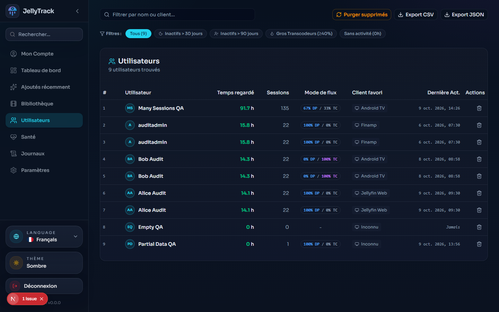 | 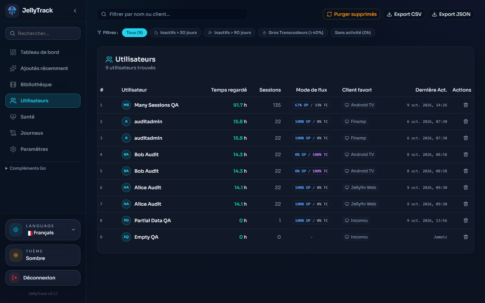 |
| Liste desktop clair | 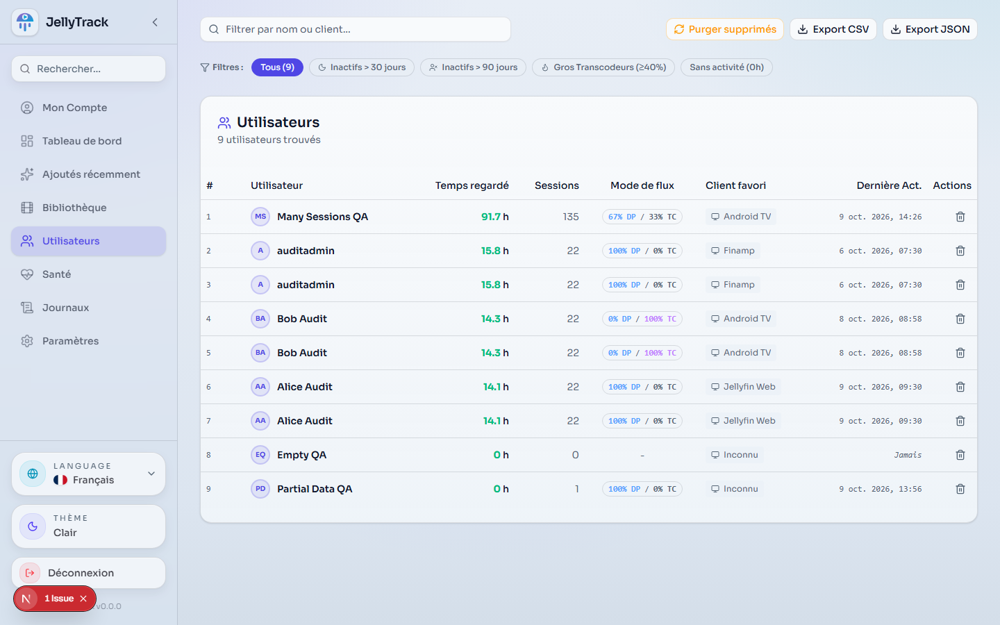 | 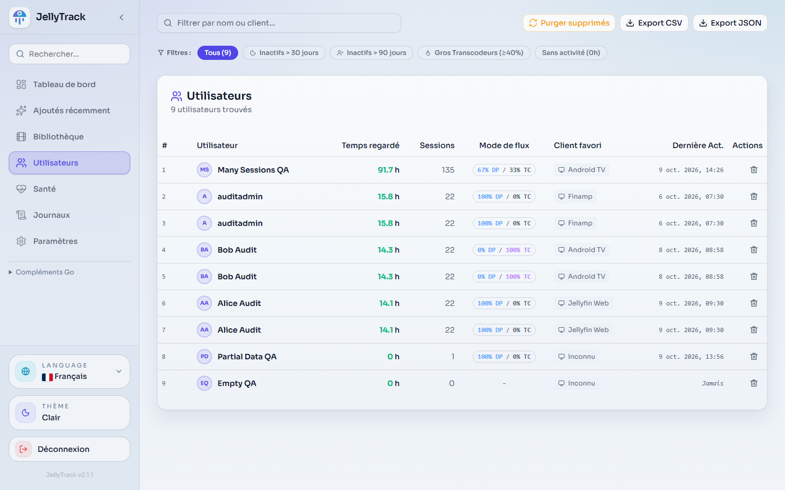 |
| Profil desktop sombre | 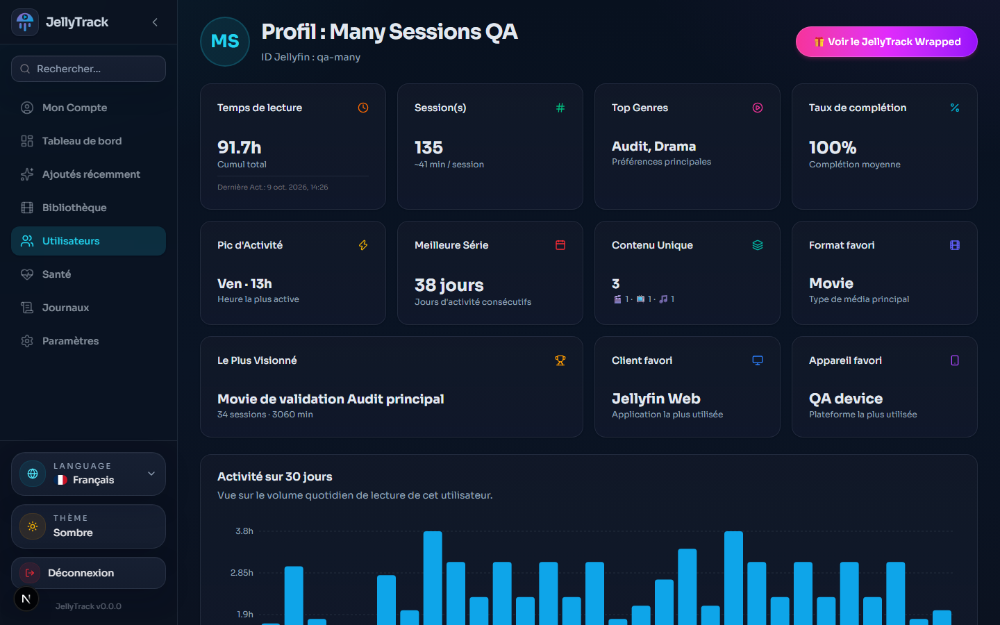 | 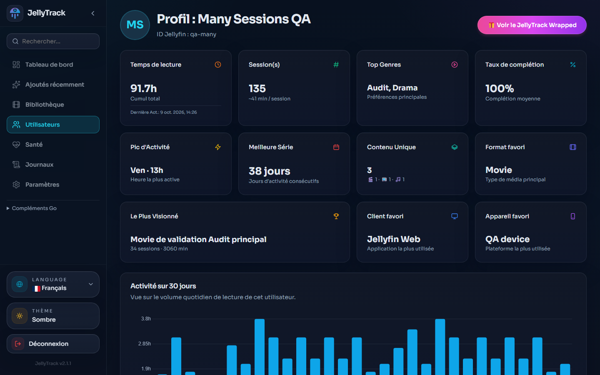 |
| Profil desktop clair | 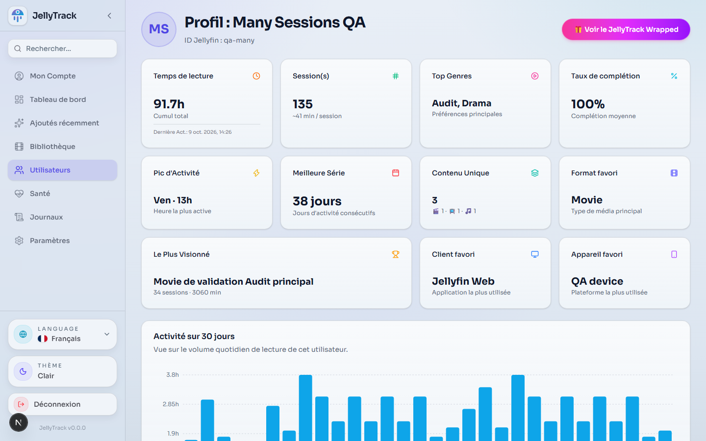 | 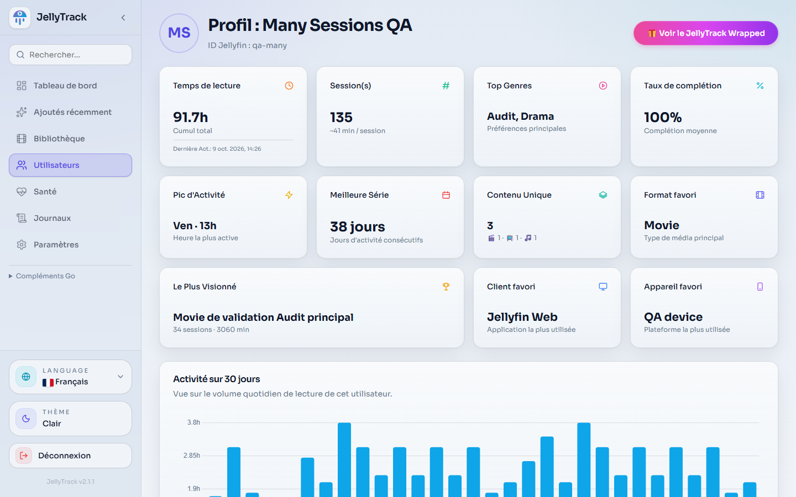 |
| Graphiques profil | 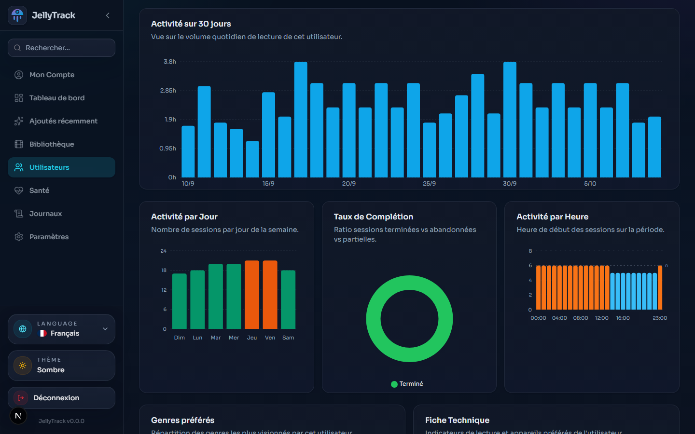 | 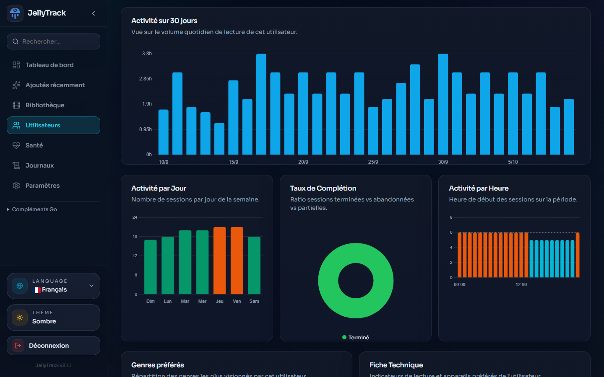 |
| Historique profil | 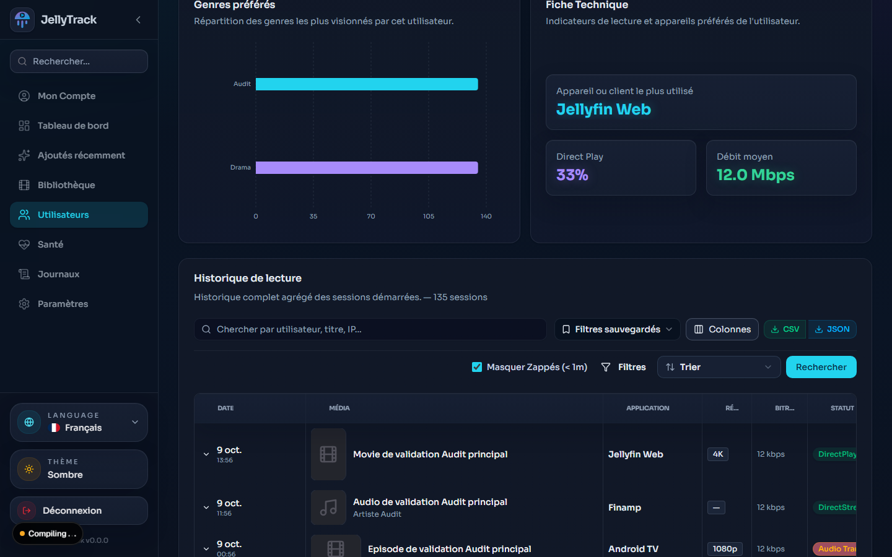 | 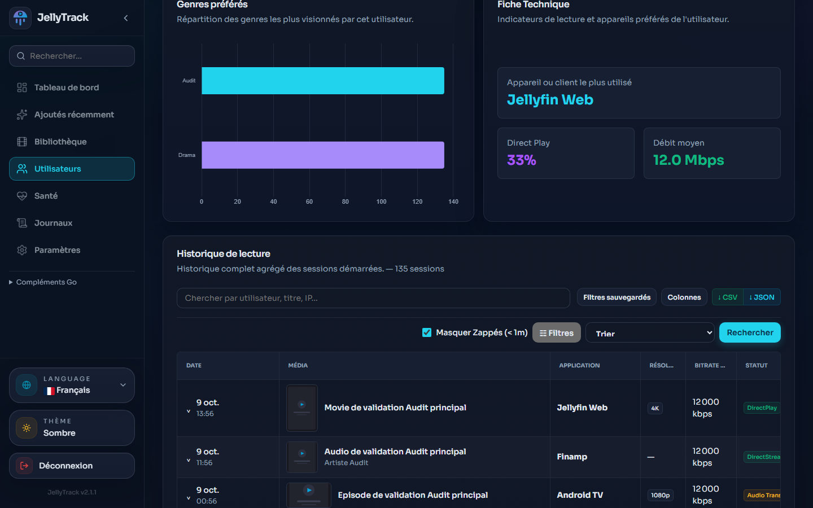 |
| Liste mobile sombre | 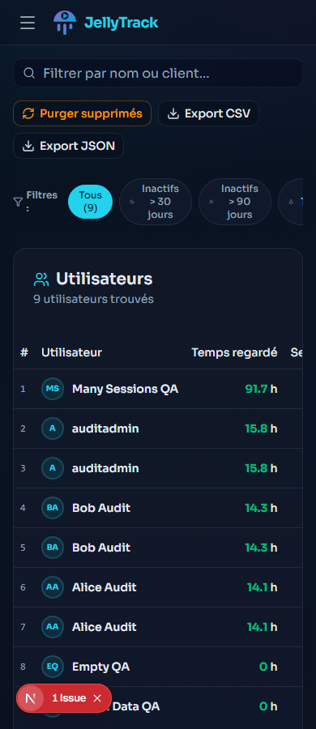 | 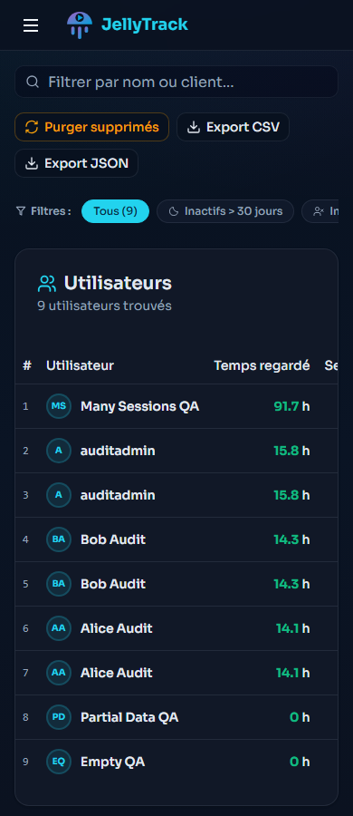 |
| Profil mobile sombre | 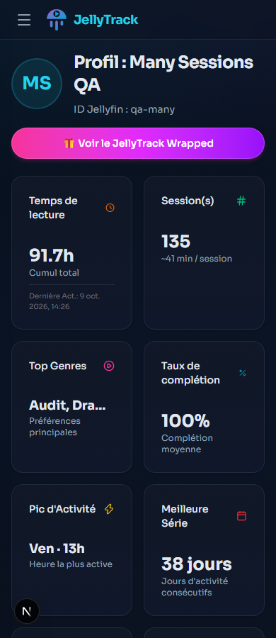 | 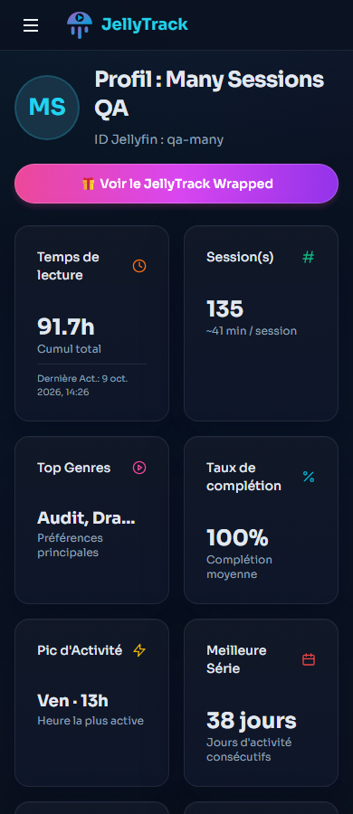 |
| Profil mobile clair | 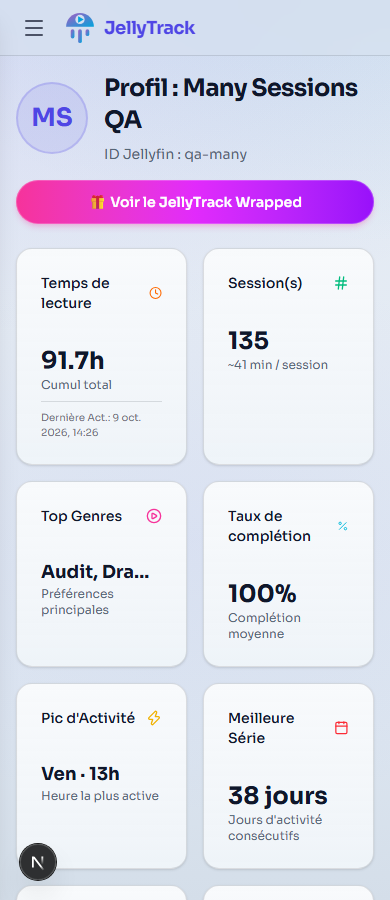 | 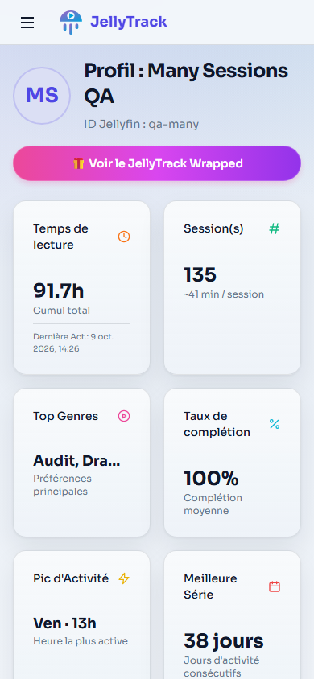 |

Les captures supplémentaires montrent le compte vide, les métadonnées partielles, les chargements, les détails d'une session et la recherche sans résultat. Les images contiennent des noms et médias synthétiques, aucun utilisateur réel.
